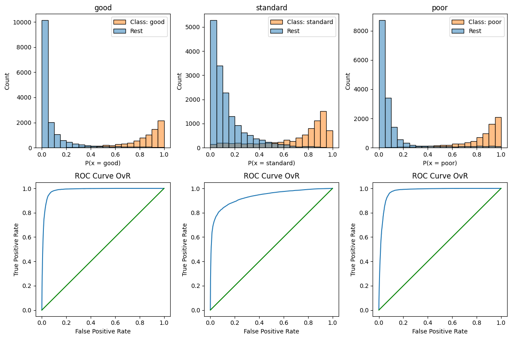
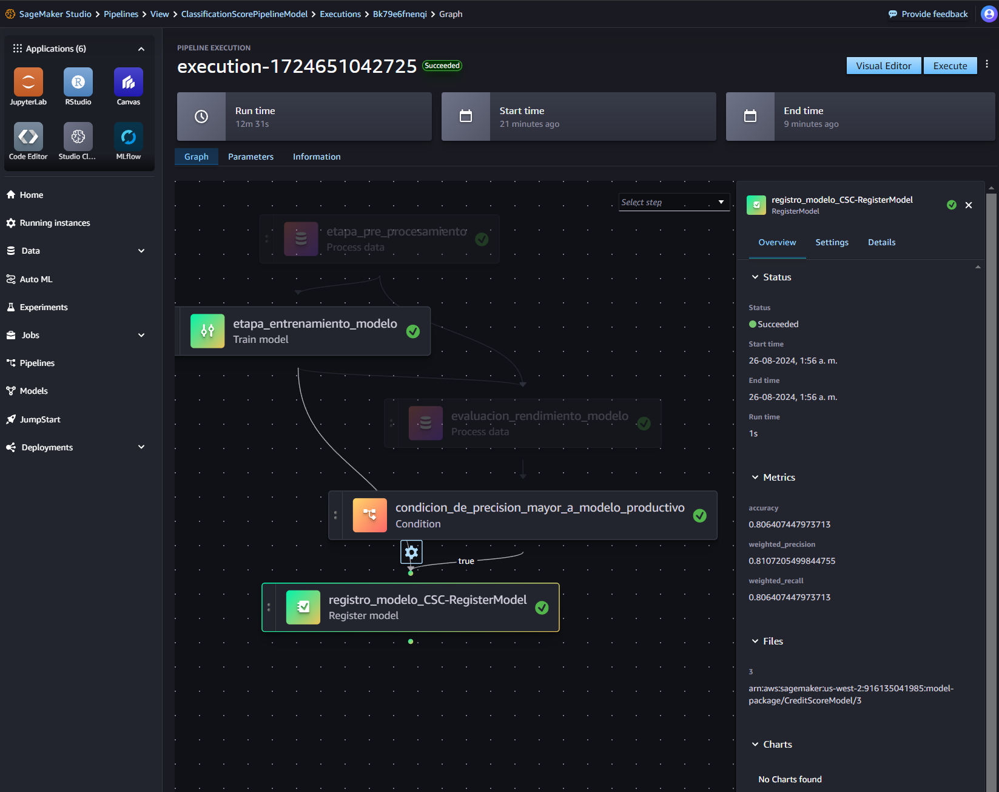

# Trabajo Final de Máster
* [LinkedIn: Joel Reyes L.](https://www.linkedin.com/in/joel-reyes-luengo-09903a317/)
## Universidad Complutense de Madrid<br/>
## Modelo de clasificación crediticia
* [Kaggle: Credit score classification](https://www.kaggle.com/datasets/parisrohan/credit-score-classification/)

## Resumen
Los modelos de clasificación crediticia son herramientas de ***machine learning*** diseñadas para segmentar individuos y entidades según su nivel de solvencia. Estos modelos utilizan diversos factores para asignar una clasificación, como el historial de pagos, los ingresos, los activos y otros indicadores financieros. Son esenciales no solo para evaluar la solvencia de manera justa y precisa, sino también para promover la inclusión financiera y reducir la discriminación en el acceso a productos y servicios financieros.<br/>

El presente repositorio contiene las distintas etapas de generación un modelo predictivo que permita clasificar a los nuevos solicitantes de crédito en diferentes niveles de riesgo: **Bueno**, **Estándar** y **Pobre**. Además se encuentra disponible la operativización del modelo en Sagemaker AI.

## Estructura de carpetas

```bash
TFM_DATA_SCIENTIST
├── data
│   ├── input
│   ├── output
│   └── model
├── img
├── notebooks
│   └── common
├── reporte
│   └── html
├── scr
│   └── code
├── README.md
├── requirements.txt
├── requirements_colab.txt
└── .gitignore
```

### Data
> Esta carpeta contiene las entrada y salidas en formato CSV de la etapa de desarrollo.

### Img
> Esta carpeta contiene algunas capturas de pantalla de la etapa de desarrollo.

### Notebooks
> Esta carpeta contiene los códigos de desarrollo: **exploración** (EDA), **transformación y modelamiento**, y de **ajuste de modelos**.<br/> Además existe una subcarpeta llamada ***common*** que contiene las funciones comunes utilizadas en esta etapa.


### Reporte
> Aquí se almacena el informe final, la presentación y las tablas asociadas al análisis y los resultados obtenidos. Además esta la carpeta ***html*** la que contiene los códigos de desarrollo, notebooks, en formato html.

### SCR
> Esta carpeta contiene el código fuente utilizado para desplegar un **pipeline de modelamiento** en ***AWS Sagemaker Pipelines***.<br/> En esta etapa se utilizó la librería de *Amazon SageMaker Python SDK*, la cuál nos permite entrenar y deplegar modelos en Amazon Sagemaker.


## Otros archivos
> * requirements.txt: librerías utilizadas durante el desarrollo.

# Calificación y Comentarios de Retroalimentación
## Evaluador: Santiago Mota
## Calificación: 10

> * DATASET DISPONIBLE: SÍ - KAGGLE - PREDICCIÓN CREDIT SCORING.
> * APLICABILIDAD: MUY BIEN
> * METODOLOGÍA: MUY BIEN
> * AMPLITUD DE ALGORITMOS: BIEN
> * PRESENTACIÓN: MUY BIEN
> * GRÁFICOS:  MUY BIEN
> * TECNOLOGÍAS EMPLEADAS: MUY BIEN
> * COMENTARIOS ADICIONALES:

Enhorabuena por el TFM, está muy bien desarrollado. Cubre todos los elementos en los que se ha insistido en la "Guía": Amplitud de algoritmos, explicatividad y productivización (en Sagemaker!).

El video es muy claro en presentar los resultados y la metodología seguida.
Igualmente la memoria está bien estructurada, se ha trabajado y está cuidada.

Se han explorado múltiples algoritmos y se han valorado resultados entre ellos.

El TFM se completa con la productivización en Sagemaker incluyendo un end-point de explotación, aspecto que puede ayudar al uso empresarial.

Enhorabuena por el trabajo.